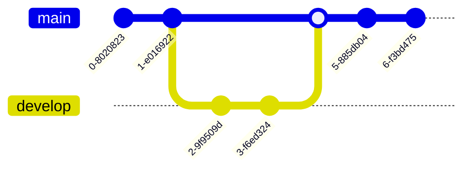

# 
Hi, I'm Ayush Nathani

  

  
  
  
  

## 👨‍💻 About Me
- 🎓 Computer Science student at **Amity University Jharkhand**
- 🌱 Currently exploring **Web Development** and **UI/UX Design**
- 💬 Ask me about **HTML, CSS, JavaScript, and React**
- 🚀 Always eager to collaborate on interesting projects
- 🎯 Goal: Contribute to Open Source projects
- ⚡ Fun fact: I enjoy designing and solving puzzles

##  Skills

  <table>
    <tr>
      <td valign="top" width="33%">
        <h3 align="center">Frontend</h3>
        

          
        

      </td>
      <td valign="top" width="33%">
        <h3 align="center">Backend</h3>
        

          
        

      </td>
      <td valign="top" width="33%">
        <h3 align="center">Tools</h3>
        

          
        

      </td>
    </tr>
  </table>

## 📊 GitHub Analytics

  

  

  

  

## 🎨 My Projects

  
  

## 📈 Activity Graph

## 🛠️ My Contributions and Workflow

## 📫 Connect With Me

  
  

---

  
    
  
    
  
   
  ⭐️ From <a href="https://github.com/ayus1234">Ayush Nathani</a>

